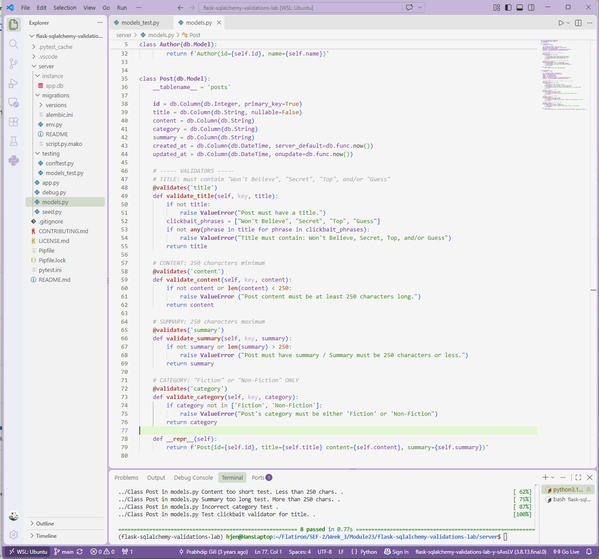

# Flask-SQLAlchemy Validations Lab
**Completed Sept 24, 2026**


## Description
A Flask backend for a blog platform that uses SQLAlchemy model validations to make sure only clean, editorial-ready data is saved to the database.
 
## Scenario
 
The editorial team for a publishing company's blog platform noticed that the system was accepting poorly formatted data: authors with missing or duplicate names, posts with too-short content, overly long summaries, invalid categories, and generic titles.
 
This project solves that problem by adding attribute-level validations directly to the `Author` and `Post` SQLAlchemy models using the `@validates()` decorator. Because the rules live in the models, invalid data is rejected with a `ValueError` the moment it is assigned, no matter where it comes from (a form, a seed script, or the Flask shell).
 
## Validation Rules:
 
### Author
 
| Field          | Rule                                                        |
| -------------- | ----------------------------------------------------------- |
| `name`         | Required, and must be unique (no two authors share a name)  |
| `phone_number` | Must be exactly ten digits, with no dashes or other symbols |
 
### Post
 
| Field      | Rule                                                                           |
| ---------- | ------------------------------------------------------------------------------ |
| `title`    | Required, and must contain "Won't Believe", "Secret", "Top", or "Guess"        |
| `content`  | Must be at least 250 characters long                                           |
| `summary`  | Optional, but if provided must be 250 characters or fewer                      |
| `category` | Must be either `Fiction` or `Non-Fiction`                                      |
 
## Technologies Used
 
- Python 3.8
- Flask
- Flask-SQLAlchemy
- Flask-Migrate
- SQLite
- pytest
- Faker
## Installation
 
1. Clone the repository:
```
   git clone https://github.com/hanjennings1/flask-sqlalchemy-validations-lab.git
   cd flask-sqlalchemy-validations-lab
```
 
2. Install dependencies and enter the virtual environment:
```
   pipenv install && pipenv shell
```
 
3. Create the database and seed it with sample data:
```
   cd server
   flask db upgrade
   python seed.py
```
 
## Usage
 
The validators run automatically whenever an attribute is set on an `Author` or `Post` object. For example, in a Flask shell:
 
```python
Author(name="Jane Author", phone_number="123-456-7890")
# ValueError: Phone number must be exactly ten digits.
 
Post(title="Why I Love Programming", content="A" * 250, category="Fiction")
# ValueError: Title must contain one of: Won't Believe, Secret, Top, or Guess.
```
 
## Running Tests
 
From the project root, with the virtual environment active:
 
```
pytest -x
```
 
All 8 tests in `server/testing/models_test.py` pass.
 

 
## Project Structure
 
```
flask-sqlalchemy-validations-lab/
├── server/
│   ├── app.py            # Flask app configuration
│   ├── models.py         # Author and Post models with validators
│   ├── seed.py           # Sample data for the database
│   ├── migrations/       # Database migration files
│   └── testing/
│       └── models_test.py
├── Pipfile
├── pytest.ini
└── README.md
```
 
 ## Known Limitations / Considerations

- Author name uniqueness is case-sensitive, so "Ben" and "ben" are treated as different names.
- The clickbait title check is case-sensitive, so phrases must be capitalized as listed (for example, "Top", not "top").
- Phone numbers must be entered as ten plain digits. Formatted numbers like "(555) 123-4567" are rejected rather than cleaned.
- Validators run only when an attribute is set on a model instance. Bulk operations such as `Author.query.update(...)` bypass them, though the database's `unique` and `nullable` constraints still apply.

